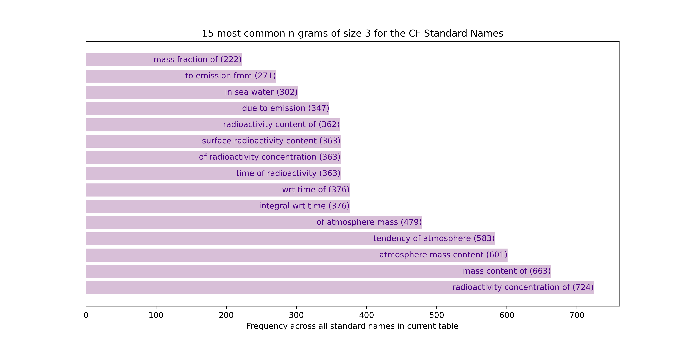
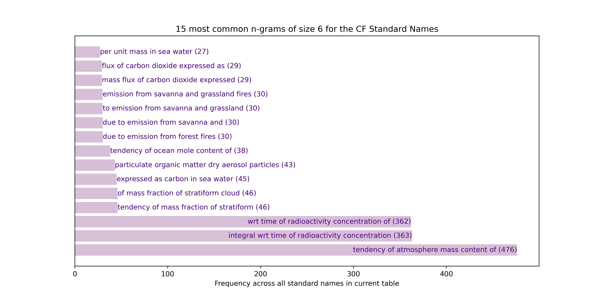
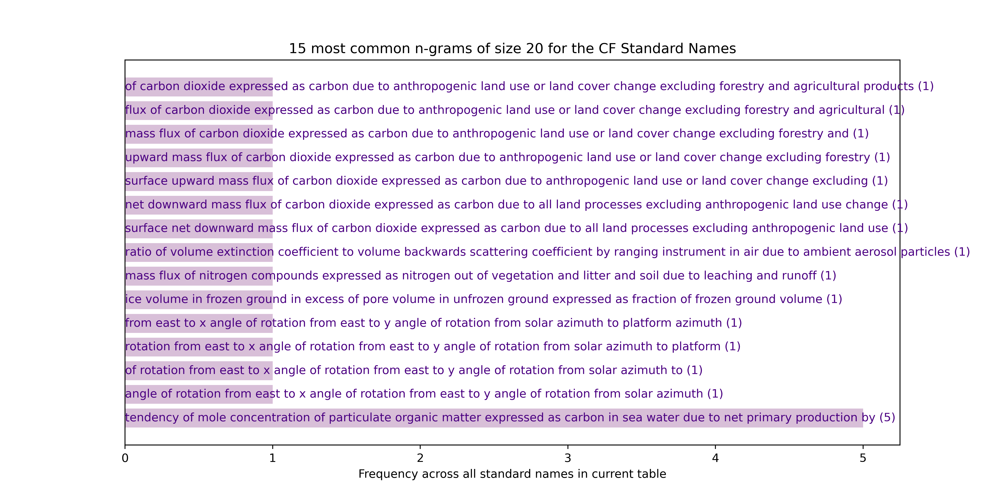

# Most common *n*-grams

## Overview

An [*n*-gram](http://www.cs.columbia.edu/~kathy/NLP/ClassSlides/Class3-ngrams09/ngrams.pdf) is a sequence of length *n* of tokens (linguistic units). Here we
take single words as the tokens to analyse.

## Results

### *n*-grams of set *n* without removal

The most frequent *n*-grams of words in the full current (version 79 with data
extracted on 24/08/22) Standard Names table of names for *n = 1* to *n = 20*
words, are as follows (note the underscores in names have been replaced
by whitespace to mimic natural text for enhanced readability):

#### Unigrams (1-grams i.e. single words)

#### Bigrams (2-grams)

#### Trigrams (3-grams)

#### 4-grams

#### 5-grams

#### 6-grams

#### 7-grams

#### 8-grams

#### 9-grams

#### 10-grams

#### 11-grams

#### 12-grams

#### 13-grams

#### 14-grams

#### 15-grams

#### 16-grams

#### 17-grams

#### 18-grams

#### 19-grams

#### 20-grams

#### *n*-grams of higher *n*

After *n*=20 there are no more *n*-grams that occur more than once across
all of the names, so further plots are not of interest. As an illustration,
here is the plot of the next *n*, *n*=21:

### *n*-grams of any *n* with recursive removal

This time, consider *n*-grams of any length and follow a process of
iterative removal, as follows:

1. Find the *n*-grams of any length that occur most frequently within the
   full table of standard names (where underscores have been replaced with
   whitespace to mimic natural text for enhanced readability).
2. If there is a single *n*-gram with the maximum frequency count in step (1),
   use that as the input to step (3). Otherwise, in the case that multiple
   *n*-grams are most common, take from this sub-list the *n*-gram(s) with
   the highest *n* as inputs to step (3). Note the *n*-grams of lower
   *n* discarded at this stage will be picked up in another iteration of
   steps (1-) unless it is an *n*-gram contained in a larger *n+N*-gram
   (for integer `N >= 1`) e.g. 'savanna and grassland' contained in
   'savanna and grassland fires' where the removal in step (3) will mean the
   *n*-gram is fully removed from the input names to the next iteration.
   (That way we keep and plot the longer *n+N*-gram for the results rather
   than the shorter one with the same count. This is preferred because the
   longer *n+N*-gram is more interesting, being a longer contiguous sequence.
3. Remove this most-common *n*-gram(2) determined in step (2) from all names
   and henceforth use the resultant reduced names as the names input;
4. Go back to step (1), taking the names reduced under (2) as the new input
   names.
5. Continue this process until the *X* most common *n*-grams of any length,
   excluding previous most-common *n*-grams which are incrementally removed,
   are found.

The results for the most common `X=60`, found by the above process, are as
follows:

*****
