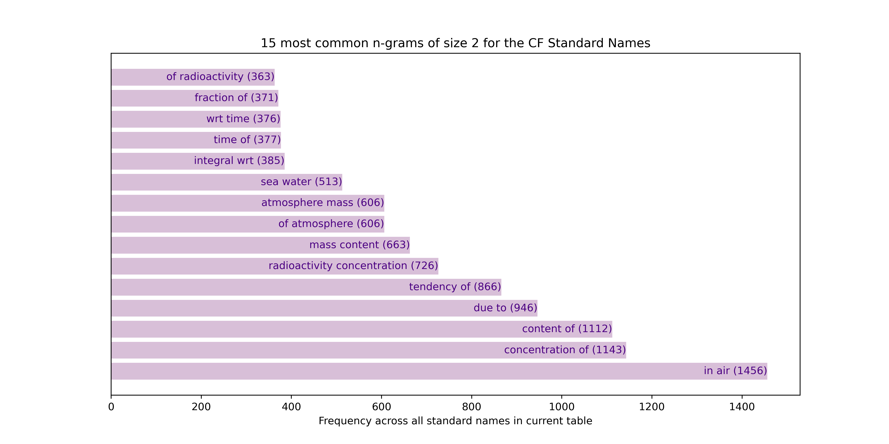
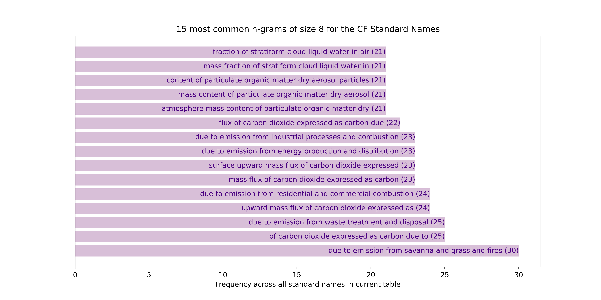
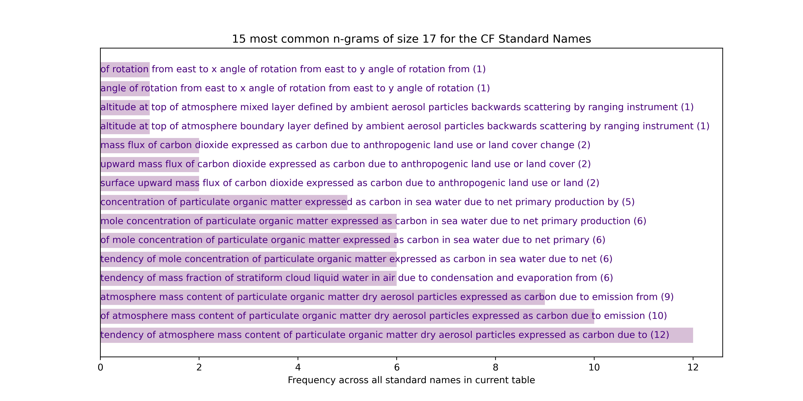

# Most common *n*-grams

## Overview

An [*n*-gram](http://www.cs.columbia.edu/~kathy/NLP/ClassSlides/Class3-ngrams09/ngrams.pdf) is a sequence of length *n* of tokens (linguistic units). Here we
take single words as the tokens to analyse.

Note here we ignore 1-grams (*n*-grams with *n = 1*, i.e. single words) as
these will be analysed in detail separately.

## Results

### *n*-grams of set *n* without removal

The most frequent *n*-grams of words in the full current (10/07/20) Standard
Names table of names for *n = 2* to *n = 15* words, are as follows (note the
underscores in names have been replaced by whitespace to mimic natural text
for enhanced readability):

#### Bigrams (2-grams)

#### Trigrams (3-grams)

#### 4-grams

#### 5-grams

#### 6-grams

#### 7-grams

#### 8-grams

#### 9-grams

#### 10-grams

#### 11-grams

#### 12-grams

#### 13-grams

#### 14-grams

#### 15-grams

#### 16-grams

#### 17-grams

#### 18-grams

#### 19-grams

#### 20-grams

#### *n*-grams of higher *n*

After *n*=20 there are no more *n*-grams that occur more than once across
all of the names. Hence further plots are not of relevance.

### *n*-grams of any *n* with recursive removal

This time, consider *n*-grams of any length and follow a process of
iterative removal, as follows:

1. find the most common *n*-gram of any length for the names, where a longer
   *n*-gram is preferred (i.e. chosen over) to a shorter one with equal count,
   since any *n*-gram contained in a larger *n+N*-gram (for integer `N >= 1`)
   will necessarily have at minimum the same count as the *n+N*-gram.
2. remove this most-common *n*-gram from all names;
3. go back to step (1), taking the names reduced under (2) as the new input
   names;
4. continue this process until the *X* most common *n*-grams of any length,
   excluding previous most-common *n*-grams, are found.

The results for the most common `X=50` are as follows:

*****
